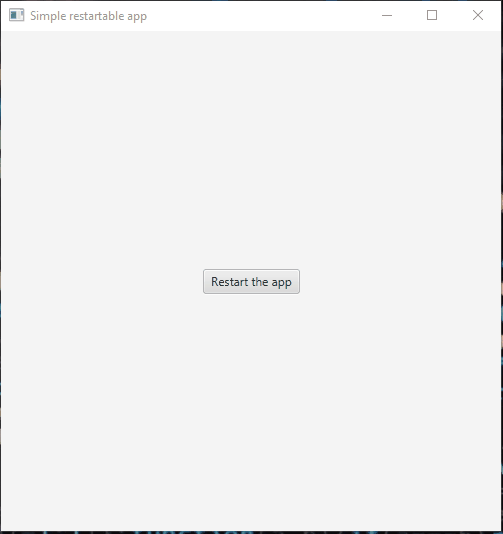

# Restart4j

Library for restarting your JVM application.
You will most likely use it for restarting your GUI application programmatically.

It works no matter how your application is running: 
 * From Jar
 * From an IDE
 * From a unique packaged form
 * etc...

### Requirements, Compatibility
* **Java 8** or higher
* Works on the 3 major platforms: **Windows**, **MacOS**, **Linux**

### Installation
...

### Some code examples

#### Simple restart
```java
final ApplicationRestart appRestart = ApplicationRestart.builder().build();
appRestart.restartApp();
```

#### Restart with more options
```java
final ApplicationRestart appRestart = ApplicationRestart.builder()
        .beforeNewProcessCreated(() -> System.out.println("New process will be created..."))
        .beforeCurrentProcessTerminated(() -> System.out.println("The app will be terminated"))
        .build();
appRestart.restartApp();
```

### Demo applications
Two demo applications can be found in the project:
 * [SimpleDemo](src/test/java/com/restart4j/SimpleDemo.java)
 * [ComplexDemo](src/test/java/com/restart4j/ComplexDemo.java)



### Used libraries

 * [SLF4j](http://www.slf4j.org/) - Simple Logging Facade for java
 * [OSHI](https://github.com/oshi/oshi) - Operating System & Hardware information
 * [Jetbrains annotations](https://github.com/JetBrains/java-annotations) - Annotations for JVM-based languages


